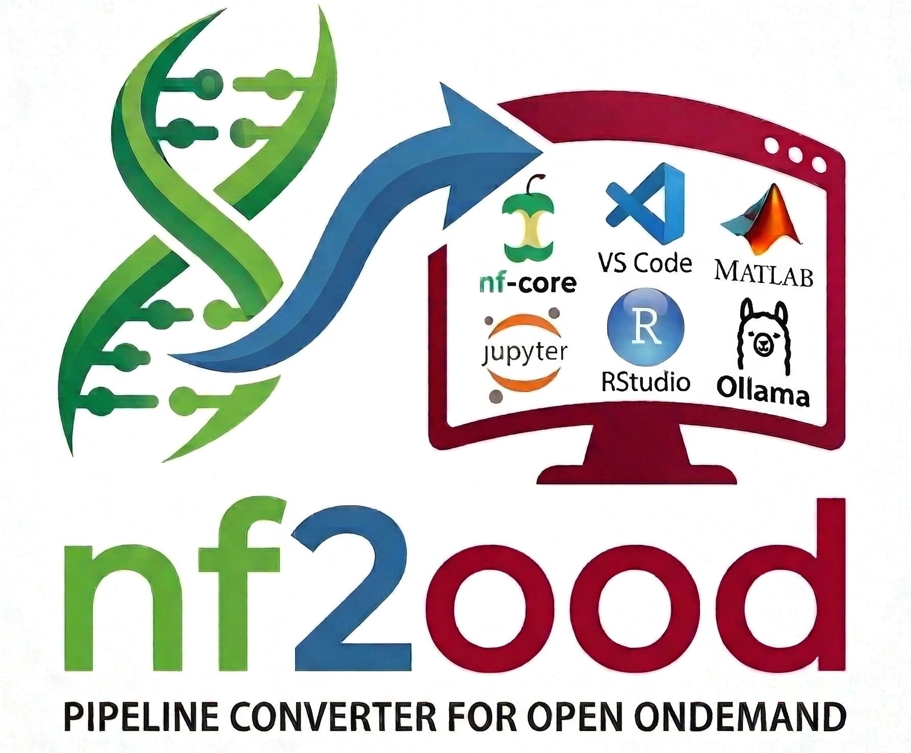

# nf2ood

`nf2ood` generates Open OnDemand batch-connect apps from locally downloaded
nf-core pipelines. The repository includes both the download step and the
pipeline-to-Open-OnDemand app generation step.



## Demo

This recording shows how to download an nf-core pipeline with
[`download_nfcore_pipeline.sh`](./download_nfcore_pipeline.sh)
and then run [`nf2ood`](./nf2ood) to
generate Open OnDemand apps.

<video src="./nf2ood_demo.mp4" controls width="100%"></video>

If the embedded player does not render in your Markdown viewer, open
[`nf2ood_demo.mp4`](./nf2ood_demo.mp4)
directly.

## Prerequisites

- `python3`
- a local copy of nf-core pipeline downloads that include `nextflow_schema.json`
- the site-specific modules and paths needed by [`download_nfcore_pipeline.sh`](./download_nfcore_pipeline.sh)

## What `nf2ood` does

- discovers nf-core pipelines and versions under an input directory
- locates `nextflow_schema.json` for each pipeline version
- converts schema fields into `form.yml.erb` and `template/nf-params.json.erb`
- creates one Open OnDemand app directory per pipeline version
- writes a per-app `README.md` for deployment review

## Recommended deployment flow

For other centers deploying nf-core workflows on Open OnDemand, the intended
workflow is:

1. Use [`download_nfcore_pipeline.sh`](./download_nfcore_pipeline.sh)
   to download nf-core pipelines onto local storage.
2. Run [`nf2ood`](./nf2ood) against
   that local pipeline tree to generate Open OnDemand apps.

This keeps pipeline installation separate from app generation and makes it
easier to adapt the deployment for another site.

## Step 1: Download pipelines locally

[`download_nfcore_pipeline.sh`](./download_nfcore_pipeline.sh)
downloads a selected nf-core pipeline and revision into a local pipeline
directory structure that `nf2ood` can consume later.

Source the shared environment file first so the downloader and generator use
the same site configuration:

```bash
source ./nf2ood.env
```

Example:

```bash
./download_nfcore_pipeline.sh --name taxprofiler --revision 1.2.6
```

The script currently:

- loads modules only when needed for your site
- downloads the requested pipeline with `nf-core pipelines download`
- stores the pipeline under a local `nf-core-<name>/<version>` directory
- replaces the per-pipeline `configs` directory with a symlink to the shared central copy
- allows site overrides through CLI flags while using defaults from `nf2ood.env`

Configs are maintained centrally under the shared nf-core install root, usually
`<install-root>/configs`. The downloader removes the downloaded local `configs`
directory and points each pipeline to that shared copy instead. This means you
update configs once in the central location and all downloaded pipelines use
the same maintained set.

The downloader does not require a container engine module. If `apptainer` or
`singularity` is already installed on `PATH`, the script can use it directly.
Use `--engine-module <name>` only at sites where the engine must be loaded as
a module first.

Important:

[`download_nfcore_pipeline.sh`](./download_nfcore_pipeline.sh)
contains Tufts-specific paths and module names such as
`/cluster/tufts/apps/container/biocontainers/nf-core`. Other centers should
update the downloader variables in
[`nf2ood.env`](./nf2ood.env) for
their own environment before downloading pipelines.

## Configuration for Step 2

Use the checked-in environment file
[`nf2ood.env`](./nf2ood.env) as the
single place to define site values:

```bash
source ./nf2ood.env
./nf2ood --input /path/to/pipelines --output /path/to/generated-apps
```

Current variables:

- `NF2OOD_ENV_FILE`: path that generated runtime scripts will try to source
- `NF2OOD_CLUSTER`: Open OnDemand cluster id written into `form.yml.erb`
- `NF2OOD_DEFAULT_DIRECTORY`: default working directory shown in the app form
- `NF2OOD_PARTITION_YML`: path to the partition partial used in the form
- `NF2OOD_MODULE_NAME`: main runtime module, default `nextflow`
- `NF2OOD_CONTAINER_MODULE`: container runtime module, default `singularity`
- `NF2OOD_PIPELINE_ROOT`: root directory containing installed nf-core pipelines
- `NF2OOD_SINGULARITY_CACHEDIR`: Singularity or Apptainer cache path
- `NF2OOD_SLURM_PROFILE`: Nextflow profile used for scheduler-backed runs

Downloader defaults are derived from those settings:

- install root defaults to the parent directory of `NF2OOD_PIPELINE_ROOT`
- configs dir defaults to `<install-root>/configs`
- container engine defaults to `NF2OOD_CONTAINER_MODULE`

## Institutional profile

`nf2ood` is currently configured around the Tufts institutional nf-core
profile, `-profile tufts`, published in
[`nf-core/configs`](https://nf-co.re/configs/tufts/). That profile is the
site-specific execution profile used for Tufts HPC deployments and is
referenced by `NF2OOD_SLURM_PROFILE="tufts"` in
[`nf2ood.env`](./nf2ood.env).

Other centers should not reuse the Tufts profile as-is. The recommended
approach is to create and maintain your own institutional profile in
`nf-core/configs`, then set `NF2OOD_SLURM_PROFILE` to that profile name in
[`nf2ood.env`](./nf2ood.env). That
keeps scheduler settings, partitions, modules, storage paths, and local site
policies aligned with your own HPC environment.

Important runtime note:

The generated job wrapper will try to source `NF2OOD_ENV_FILE` again at job
runtime. By default, `nf2ood.env` sets this to the `nf2ood.env` file next to
[`nf2ood`](./nf2ood). That only works
if the same path is visible from the Open OnDemand host and compute nodes.

## Step 2: Generate Open OnDemand apps

Source the shared environment file first:

```bash
source ./nf2ood.env
./nf2ood --input /path/to/pipelines --output /path/to/generated-apps
```

Optional flags:

- `--image-map /path/to/pipeline2image.tsv`: override the default pipeline image map
- `--force`: remove the output directory before regeneration

Help:

```bash
./nf2ood --help
```

## Input layout

`nf2ood` expects one directory per pipeline and one directory per version. It
looks for `nextflow_schema.json` in the common nf-core download layouts.

```text
pipelines/
├── nf-core-rnaseq/
│   └── 3.18.0/
│       └── 3_18_0/
│           └── nextflow_schema.json
└── nf-core-bamtofastq/
    └── 2.1.1/
        └── 2_1_1/
            └── nextflow_schema.json
```

Schema discovery currently checks these locations in order:

```text
<input>/<pipeline>/<version>/<version_underscored>/nextflow_schema.json
<input>/<pipeline>/<version>/nextflow_schema.json
<input>/<pipeline>/<version_underscored>/nextflow_schema.json
<input>/<pipeline>/nextflow_schema.json
```

## Generated app contents

Each generated app directory includes:

- `manifest.yml`
- `form.yml.erb`
- `form.js`
- `submit.yml.erb`
- `view.html.erb`
- `template/before.sh.erb`
- `template/script.sh.erb`
- `template/nf-params.json.erb`
- `README.md`
- app assets from the shared template such as `icon.png`, `LICENSE.txt`, and `CHANGELOG.md`

## Current generated behavior

- the form header can show a pipeline image, with `max-width` and `max-height`
  both set to `600px`
- the partition field comes from:
  `<%= File.read(NF2OOD_PARTITION_YML).indent(2) %>`
- the runtime script can load both a workflow module and a container module
- local executor mode generates a small `custom.config`
- Slurm mode runs `nextflow` with the configured `NF2OOD_SLURM_PROFILE`
- generated schema field names are normalized so Open OnDemand hide rules do
  not break when digits appear inside field names

## Image mapping

By default, `nf2ood` uses [`pipeline2image.tsv`](./pipeline2image.tsv)
when it exists. That file maps pipeline names to header image URLs.

If the TSV file exists but a pipeline is not listed, no image is rendered for
that app. If the TSV file does not exist, `nf2ood` falls back to a best-effort
GitHub raw image URL pattern.

## Portability notes

This repository is more configurable than the earlier script, but the generated
apps still assume:

- Open OnDemand batch connect conventions
- a partition partial file compatible with your site
- a module environment if you want module loading
- an nf-core pipeline installation layout under `NF2OOD_PIPELINE_ROOT`
- a scheduler profile name understood by your local nf-core pipeline installs

Those are the main areas to review before sharing the generated apps with other
centers or preparing an Appverse submission.

## Contributor


Yucheng Zhang  
Research Technology, Tufts Technology Services  
Tufts University  
yucheng.zhang@tufts.edu

## License

This repository is released under the MIT License. See [LICENSE](LICENSE).
